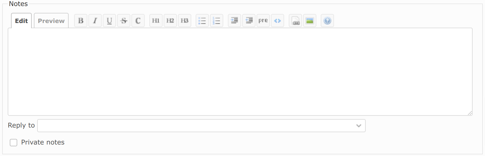
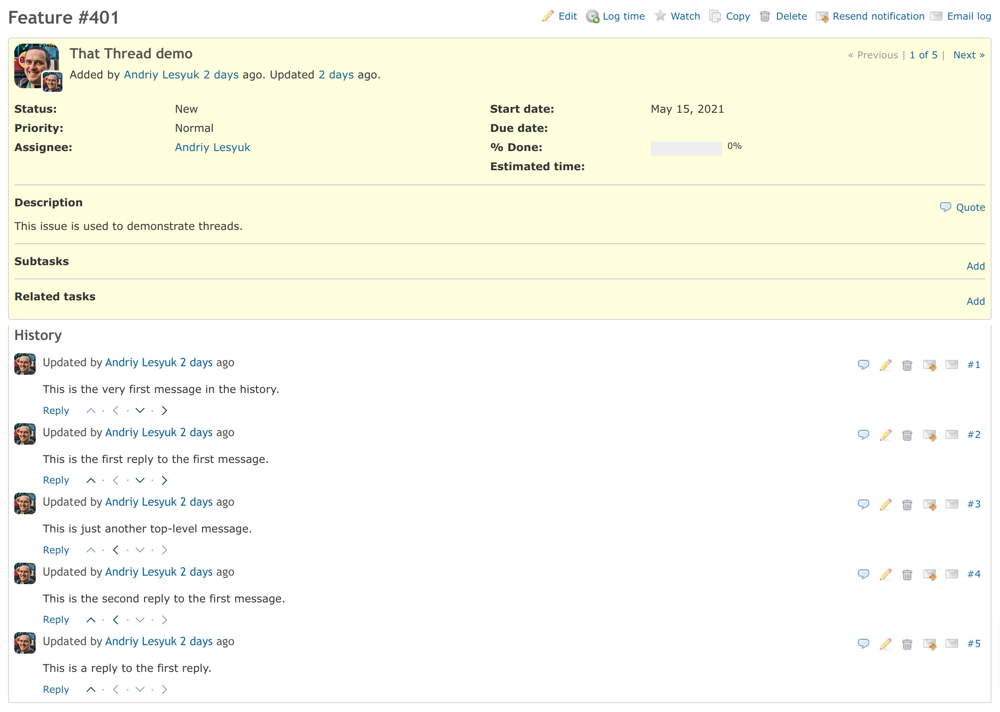
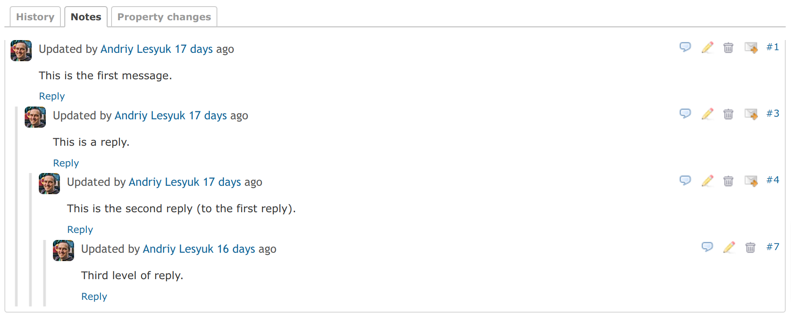

# That Thread Plugin

This plugin adds email-like thread capability to Redmine's issues and forums.

Want to thread a reply? Use the new **Reply** link:

Or choose the original message in the new **Reply to** select box:

The plugin provides two ways of enabling threads in Redmine user interface:

To easily navigate the thread tree you can use the new buttons which can be enabled
via the **Navigation buttons** option in the plugin's settings:

Or you can visualize the thread by choosing the **Threaded view** option there:

Note that the threaded view is not compatible with the reverse chronological order of comments,
therefore if you've chosen this option in Redmine you won't see the thread. Also, when enabled
the threaded view will display all forum topic's messages on one page (i.e., pagination will be disabled).
Finally, to be able to choose the **Threaded view** option on Redmine 4.0 and below you'll need to
install the [Issue Tabs](http://rmplus.pro/en/redmine/plugins/issue_tabs) plugin.
*Redmine 4.1 and above comes with own issue history tabs implementation.*

The plugin also enables threads in Redmine email notifications:

When you receive notifications from Redmine there is no excerpt from the prior
communication sent along with it. This can make it a little confusing at times
to determine what the notification email is referring to. Once
**Quotes in email notifications** option is enabled, the prior communication will
be sent along with the current notification so it is clear what is being replied to.
Email communication becomes far more useful when the thread is sent along and email
communication in Redmine becomes much more understandable with this option.

For Redmine 4.0 and below: You can also make it possible for email clients to build threads
from Redmine email notifications. Just enable **Fix email Message-IDs** option for this.
*This is included into Redmine 4.1 and above.*

## Installation

- Move `that_thread` directory to the `plugins` directory of Redmine
- Run `rake redmine:plugins:migrate RAILS_ENV=production`
- Restart Redmine

## License

GNU General Public License (GPL) v2.0

## Used Icons

- https://www.iconfinder.com/icons/1814087/arrow_top_up_icon (Alexander Madyankin, Roman Shamin)
- https://www.iconfinder.com/icons/1814084/arrow_back_left_previous_icon (Alexander Madyankin, Roman Shamin)
- https://www.iconfinder.com/icons/1814082/arrow_bottom_down_icon (Alexander Madyankin, Roman Shamin)
- https://www.iconfinder.com/icons/1814086/arrow_forward_next_right_icon (Alexander Madyankin, Roman Shamin)
